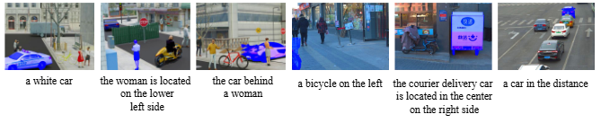
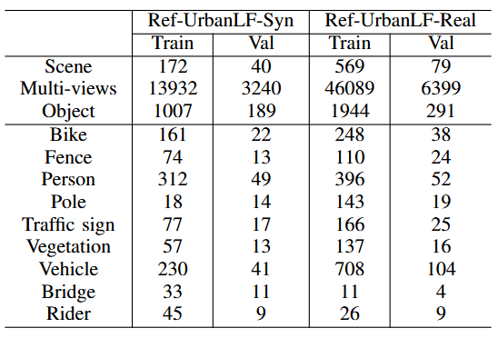
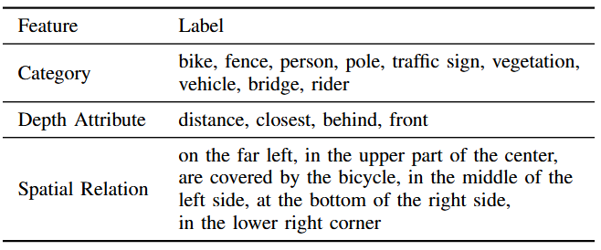
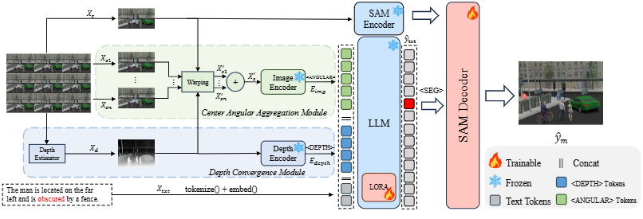
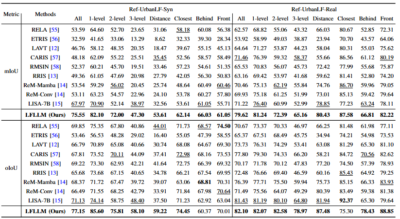

# Light Field Referring Segmentation: A benchmark and An LLM-based Approach

**by Shishun Tian, Qian Xu, He Gui, Ting Su, Yan Li, and Qiong Wang***

**[[TBC2026 Paper]]()**

## Abstract

>Referring image segmentation (RIS) is a challenging task that requires models to segment objects based on natural language descriptions. Existing RIS models have limited leverage of geometric information, resulting in multimodal mismatch between language and vision. In contrast to conventional 2D images, light field imaging gathers rays emitted from light sources in all directions. This unique characteristic enriches the comprehensive understanding of scenes, which provides us with a new way to optimize RIS. In this paper, we propose the first light field referring segmentation dataset, which contains rich occluded objects and depth-referring descriptions. Afterward, we benchmark the performance of existing 2D referring image segmentation methods on the proposed dataset. The results revealed that these methods show limited efficacy in occluded scenes and depth-based descriptions of scenes. To this issue, we propose a novel framework, termed LFLLM, for light field referring segmentation. Specifically, we propose a Center Angular Aggregation Module that warps the views adjacent to the central view to prevent feature occlusion caused by viewpoints misalignment and a Depth Convergence Module that adds a depth token into the LLMs to leverage the depth information in the light field. Extensive experiments demonstrate that our approach outperforms the current state-of-the-art methods. 


## Benchmark



### Dataset Splitting

The detailed number of categories in the proposed Ref-UrbanLF-Syn and Ref-UrbanLF-Real datasets is shown in the Table.



In the Ref-UrbanLF dataset, we identify 9 distinct categories and 4 depth attribute tags that can be used to describe objects, as shown in the Table.



### Data Link

Ref-UrbanLF-Real and Ref-UrbanLF-Syn are publicly available in [Baiduyun](https://pan.baidu.com/s/1-aAifpRd3nF8yasnaH0hvA) (key: fgb3). 


## Network architecture



## Comparison with SOTA metrics

Performance evaluation on Ref-UrbanLF dataset:


## Setup Environment

In that environment, the requirements can be installed with:

```shell
pip install -r requirements.txt
pip install flash-attn --no-build-isolation
```

All experiments were executed on two NVIDIA GeForce RTX 4090.

### Pre-trained weights

#### LLaVA

To train LFLLM, you need to follow the [instruction](https://github.com/haotian-liu/LLaVA/blob/main/docs/MODEL_ZOO.md) to merge the LLaVA delta weights. Typically, we use the final weights `LLaVA-Lightning-7B-v1-1` and `LLaVA-13B-v1-1` merged from `liuhaotian/LLaVA-Lightning-7B-delta-v1-1` and `liuhaotian/LLaVA-13b-delta-v1-1`, respectively. For Llama2, we can directly use the LLaVA full weights `liuhaotian/llava-llama-2-13b-chat-lightning-preview`.

#### SAM ViT-H weights

Download SAM ViT-H pre-trained weights from the [link](https://dl.fbaipublicfiles.com/segment_anything/sam_vit_h_4b8939.pth).

### Training

```
deepspeed  --include localhost:0,1 \
 --master_port=23999 train_ds.py \
  --version="/LFLLM/checkpoint/LFLLM-7B-v1" \
  --dataset_dir='/LFLLM/dataset' \
  --vision_pretrained="/LFLLM/sam_vit_h_4b8939.pth" \
  --dataset="refer_seg" \
  --refer_seg_data="ref-urbanlf-syn" \
  --sample_rates="1" \
  --val_dataset="ref-urbanlf-syn|syn|person" \
  --exp_name="lfllm" 
```

When training is finished, to get the full model weight:

```
cd ./runs/lfllm/ckpt_model && python zero_to_fp32.py . ../pytorch_model.bin
```

### Merge LoRA Weight

Merge the LoRA weights of `pytorch_model.bin`, save the resulting model into your desired path in the Hugging Face format:

```
CUDA_VISIBLE_DEVICES="" python merge_lora_weights_and_save_hf_model.py \
  --version="PATH_TO_LLaVA" \
  --weight="PATH_TO_pytorch_model.bin" \
  --save_path="PATH_TO_SAVED_MODEL"
```

For example:

```
CUDA_VISIBLE_DEVICES="0,1" python3 merge_lora_weights_and_save_hf_model.py \
  --version="/checkpoint/LFLLM-7B-v1" \
  --weight="/LFLLM/runs/lfllm-7b-syn/pytorch_model.bin" \
  --save_path="/LFLLM/LFLLM-7b-syn"
```

### Validation

```
deepspeed --master_port=24999 train_ds.py \
  --version="/mnt/mdisk/xxx/LFLLM/checkpoint/LFLLM-7B-v1" \
  --dataset_dir='/mnt/mdisk/xxx/LFLLM/dataset' \
  --vision_pretrained="./sam_vit_h_4b8939.pth" \
  --exp_name="xxx" \
  --dataset="refer_seg" \
  --val_dataset="ref-urbanlf-syn|syn|val" \
  --eval_only
```


## Citation

If you find LFLLM and Ref-UrbanLF useful in your research, please consider citing:

```
@Article{}
```

## Acknowledgements

LFLLM and Ref-UrbanLF is based on the following open-source projects. We thank the authors for making the source code publicly available.

* [LISA](https://github.com/JIA-Lab-research/LISA)
* [UrbanLF](https://github.com/HAWKEYE-Group/UrbanLF)
* [LLaVA](https://github.com/haotian-liu/LLaVA) 
* [SAM](https://github.com/facebookresearch/segment-anything)

